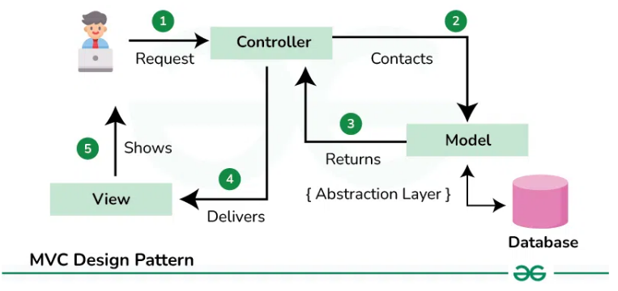
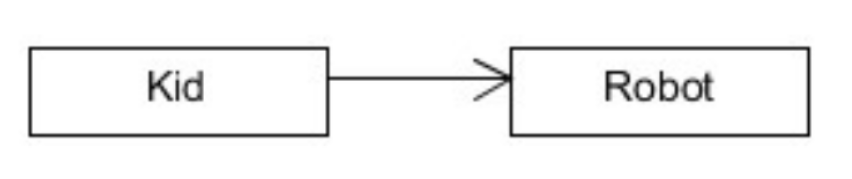
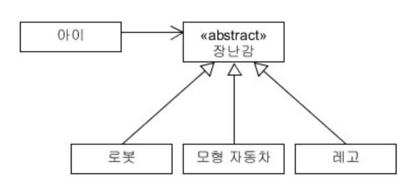

# week3 정리 내용

## 💡데이터베이스 모델링 규칙

---

### 무결성 | Integrity

> 데이터의 정확성과 일관성, 유효성을 보장한다.
> 
> 데이터베이스 내의 데이터가 변경될 때 규칙에 맞게 적용되도록 하여, 데이터의 신뢰성을 유지한다.

1. **개체 무결성 (Entity integrity)**
    - 각 테이블이 pk로 선택된 column을 가져 테이블의 각 행을 고유하게 식별할 수 있어야 한다.
   

2. **도메인 무결성 (Domain integrity)**
    - 각 열의 데이터가 정해진 형식과 범위 내에 있어야 한다.
   

3. **참조 무결성 (Referential integrity)**
    - fk를 이용해 테이블 간 관계를 설정하며, 참조되는 값이 삭제되거나 변경되지 않도록 제약을 두어야 한다.
    - 테이블 간의 관계에서 일관성을 유지한다.

### 안정성 | Reliability

> 백업, 로그 기록, 복구 기법 등을 통해 데이터와 시스템의 지속적인 가용성을 보장한다.
> 
> ⇒ 예상치 못한 장애나 시스템 오류가 발생하더라도 데이터가 손상되지 않고 안전하게 보관되도록.

### 확장성 |  Scalability

>데이터베이스 시스템의 성능과 처리 능력을 확장할 수 있는 능력.
>
>시스템이 성장하고 변화하는 요구사항에 적응할 수 있도록 설계해야 한다.

## 💡JPA (Java Persistence API)

---

> 자바 애플리케이션에서 데이터베이스와 객체 간의 매핑을 지원하는 자바 표준 인터페이스

- 엔티티 클래스를 데이터베이스 테이블에 매핑하여, 자바 객체를 통해 DB의 데이터를 조작할 수 있도록 한다.
    - `@Entity`, `@Table`, `@id` 등의 어노테이션
  

- EntityManager나 Repository 등의 인터페이스를 통해 기본적인 CRUD 작업을 쉽게 수행 가능하다.

- 다른 **DBMS***로 쉽게 전환 가능하다.

- **transaction*** 처리를 통해 일관성을 보장한다.

**DBMS**(Database Management System)* : MySQL, Oracle, MongoDB와 같이 데이터베이스를 생성, 관리, 제어하는 소프트웨어

**Transaction*** : 데이터베이스에서 논리적인 작업의 단위. 원자성, 일관성, 고립성, 지속성 등을 보장함. ⇒ 데이터베이스에서 여러 작업을 하나의 단위로 묶어 일관성과 무결성을 유지

## 💡DTO (Data Transfer Object)

---

> 데이터를 전달하기 위한 객체로, 주로 계층 간 데이터 전달을 위해 사용된다. 
> 
>데이터의 전달과 표현에만 집중하고, 비즈니스 로직이나 데이터 조작 메서드는 가지지 않는다.

## 💡 MVC Pattern

---

> 어플리케이션을 M, V, C의 세 가지 역할로 분리하여 각각 데이터 관리, 사용자 인터페이스, 비즈니스 로직을 책임지는 구조

- **Model (Service)**
    - 어플리케이션의 핵심 데이터와 비즈니스 로직.
    - 엔티티, DTO, 비즈니스 로직을 수행하는 서비스가 해당.
    - 필요한 데이터를 정의하고, Controller에 전달.
- **View**
    - 사용자에게 보여지는 화면을 구성.
    - 데이터를 표시하고 사용자에게 입력을 받을 수 있도록 UI를 제공함.
    - `JSP`, `HTML` 등으로 구성됨.
- **Controller**
    - 사용자의 요청을 받아서 적절한 서비스 호출하고, 처리 결과를 View로 전달하는 역할.
    - HTTP 요청을 매핑하고, 비즈니스 로직을 처리함.
    - `@Controller`, `@RestController` 등의 어노테이션

### 작동 과정 예시

GET /user/1 으로 특정 사용자의 정보를 조회 할 때,

1. **Controller** : `@GetMapping(”user/{id}”)` 로 사용자 데이터를 가져옴
2. **Service(Model)** : 데이터베이스에서 사용자 정보를 조회하고 필요한 비즈니스 로직 처리
3. **DTO**로 데이터를 구성하고 컨트롤러로 반환
4. **View** : 데이터를 사용자에게 표시

## 💡의존성 역전 원칙

---

**의존** : 한 클래스가 다른 클래스의 기능이나 데이터를 필요로 하여 그 클래스에 대한 참조를 가지고 있는 상태. ⇒ 한 클래스가 작업을 수행하기 위해 다른 클래스의 도움을 필요로 하는 관계

**추상화** : 여러 객체에서 공통적인 특성이나 동작을 뽑아내어 일반적인 개념을 정의하는 것.

### 의존성 역전 원칙(Dependency Inversion Principle)

고수준 모듈이 저수준 모듈에 의존하지 않도록 하고, 둘 다 추상화에 의존하도록 만드는 원칙.

객체에서 어떤 Class를 참조해서 사용해야 한다면, 그 Class를 직접 참조하는 것이 아니라 그 대상의 상위 요소로 참조하라!!

**고수준 모듈** : 어떤 의미있는 단일 기능을 제공하는 모듈(interface, 추상 클래스 등)

**저수준 모듈** : 고수준 모듈의 기능을 구현하기 위해 필요한 구체적인 세부 구현을 담당하는 부분(메인 클래스, 객체 등).

고수준 모듈 → 저수준 모듈 ❌

고수준 모듈 → **추상화 계층** → 저수준 모듈 ⭕

