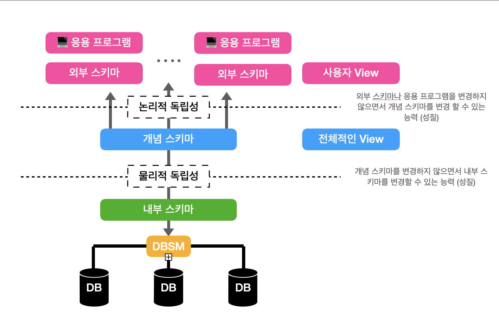
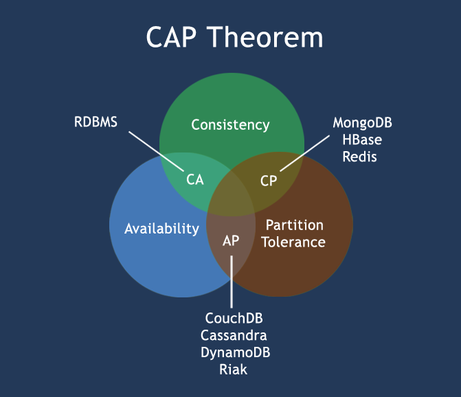

# week3

세미나 자료를 보면서, 잘 모르겠는 개념이나 모호한 개념들을 정리해보았습니다!

## 1. RDB 와 NoSQL의 차이는 무엇일까요?

**1) 데이터 구조와 저장 방식**

- **RDB (관계형 데이터베이스)**: 데이터를 **테이블**로 구성하며, 행과 열을 사용해 데이터를 저장합니다. 테이블은 서로 **관계**를 통해 연결되며, SQL 쿼리를 사용하여 데이터 조작 및 검색을 수행합니다.
- **NoSQL (비관계형 데이터베이스)**: 데이터를 **유연한 형식**으로 저장합니다. JSON, 키-값, 컬럼 기반, 그래프 형식 등 다양한 저장 방식을 지원합니다. 데이터 간의 관계보다는 **빠른 조회와 유연한 데이터 구조**가 필요할 때 사용됩니다.

**2) 스키마와 유연성**

- **RDB**: **엄격한 스키마**가 존재합니다. 테이블에 저장될 데이터 구조를 미리 정의해야 하며, 스키마를 변경하려면 복잡한 작업이 필요합니다.
- **NoSQL**: **유연한 스키마**를 지원합니다. 데이터의 구조가 변동적일 수 있으며, 새로운 필드를 쉽게 추가할 수 있어 **비정형 데이터**나 **빠른 데이터 변화**에 적합합니다.

**3) 관계성 (Relationship)**

- **RDB**: 데이터 간의 **관계(1:1, 1:N, N:M)**를 테이블 간의 **조인**(Join)으로 쉽게 관리할 수 있습니다. 예를 들어, 고객 테이블과 주문 테이블 간의 관계를 조인으로 구현하여 관련 데이터를 결합합니다.
- **NoSQL**: 데이터 간의 관계를 기본적으로 지원하지 않으며, 일반적으로 **중복 데이터**로 관계를 표현합니다. 데이터베이스가 관계를 따로 처리하지 않기 때문에 **조인 기능이 거의 없거나 제한적**입니다.

**4) 확장성 (Scalability)**

- **RDB**: **수직적 확장(Scale-up)**에 최적화되어 있습니다. 데이터가 증가할 때 서버의 성능을 높이는 방식으로 확장하며, 수평적 확장(Scale-out)에는 제약이 있습니다.
- **NoSQL**: **수평적 확장(Scale-out)**에 적합합니다. 여러 서버에 데이터를 분산하여 저장할 수 있어 대량의 데이터를 처리하기 용이합니다. 클라우드 환경에서 **확장성과 가용성**이 중요한 경우 적합합니다.

**5) 트랜잭션과 일관성**

- **RDB**: ACID(Atomicity, Consistency, Isolation, Durability) 특성을 준수하여, **데이터 일관성**을 보장합니다. 이로 인해 은행, 금융 서비스와 같은 **높은 데이터 무결성**이 중요한 분야에서 자주 사용됩니다.
- **NoSQL**: 일반적으로 **CAP 이론**(Consistency, Availability, Partition tolerance)을 따릅니다. 데이터 일관성보다는 **가용성**과 **속도**를 우선시하며, 일부 NoSQL DB는 분산 환경에서 데이터를 빠르게 처리하는 대신 데이터 일관성을 일시적으로 포기할 수 있습니다.

**6) 사용 사례**

- **RDB**: 트랜잭션과 관계 데이터가 중요한 시스템에 주로 사용됩니다.
    
    예 | 금융 서비스, ERP 시스템, 전자 상거래
    
- **NoSQL**: 데이터 구조가 자주 변경되거나, 대용량 데이터를 빠르게 처리해야 하는 시스템에 적합합니다.
    
    예 | 소셜 네트워크, IoT, 실시간 분석 시스템
    

**요약**

|  | RDB | NoSQL |
| --- | --- | --- |
| 데이터 구조 | 테이블 기반 구조 (행과 열) | 키-값, 문서, 컬럼, 그래프 형식 |
| 스키마 | 고정된 스키마 | 유연한 스키마 |
| 관계성 | 관계(조인) 지원 | 관계를 중복 데이터로 관리하거나 미지원 |
| 확장성 | 수직적 확장 (Scale-up) | 수평적 확장 (Scale-out) |
| 일관성 | ACID 준수 | CAP 이론 준수, 데이터 일관성 유동적 |
| 사용 사례 | 트랜잭션이 중요한 서비스 | 대규모 데이터 처리, 실시간 데이터 분석 |

## 꼬리에 꼬리를 무는 질문,,
### 1.1 스키마 -?

**스키마**는 데이터베이스에서 데이터 구조와 제약 조건을 정의하는 “설계도”와 같은 개념입니다. 스키마는 **테이블의 이름, 컬럼의 데이터 타입, 기본 키, 외래 키 등**을 사전에 정의하여 데이터가 일관된 구조로 저장될 수 있게 해줍니다.

**1) 외부 스키마 (External Schema)**

**외부 스키마**는 데이터베이스의 **사용자나 애플리케이션 관점에서 데이터 구조를 정의한 부분**입니다. 외부 스키마는 각 사용자에게 필요한 정보만 보여주기 때문에, 보안과 관련이 깊으며, 서로 다른 사용자들이 자신에게 필요한 데이터를 개별적으로 볼 수 있게 합니다.

- **예시**: 쇼핑몰 데이터베이스의 경우, 고객과 관리자가 필요로 하는 정보가 다릅니다.
    - **고객**: 고객에게 필요한 정보는 자신의 이름, 주소, 구매 내역 등으로, 고객은 본인과 관련된 정보만 볼 수 있습니다.
    - **관리자**: 관리자는 재고 현황, 전체 고객 정보, 판매 내역 등 좀 더 광범위한 데이터가 필요합니다.

→ 이처럼 외부 스키마는 사용자마다 다른 관점을 제공하여 필요한 데이터만 접근할 수 있게 합니다.

**2) 개념 스키마 (Conceptual Schema)**

**개념 스키마**는 **데이터베이스 전체의 논리적 구조를 정의한 스키마**로, 모든 사용자와 애플리케이션이 공통으로 사용하는 데이터 구조를 나타냅니다. 데이터베이스의 테이블, 열, 관계, 제약 조건 등이 개념 스키마에 정의됩니다. 이는 데이터베이스의 **중앙 관리자 관점**에서 데이터의 구조를 정의한 것입니다.

- **예시**: 쇼핑몰 데이터베이스의 개념 스키마는 데이터베이스의 주요 테이블과 관계를 나타냅니다.
    - **테이블**: 고객(Customer), 주문(Order), 제품(Product), 재고(Stock) 테이블이 존재할 수 있습니다.
    - **관계**: 고객과 주문 테이블은 1:N 관계를 가질 수 있으며, 주문과 제품 테이블은 M:N 관계로 연결될 수 있습니다.
    - **제약 조건**: 예를 들어, 고객 ID는 주문 테이블에 외래 키로 설정하여, 주문을 한 고객이 실제로 존재해야 하는 제약 조건을 부여할 수 있습니다.

→ 개념 스키마는 모든 사용자에게 공통으로 제공되는 데이터 구조를 정의하기 때문에, 외부 스키마에서 필요한 데이터가 이 개념 스키마를 기반으로 추출됩니다.

**3) 내부 스키마 (Internal Schema)**

**내부 스키마**는 **물리적 관점에서 데이터베이스가 어떻게 저장되고 관리되는지**를 정의하는 스키마입니다. 데이터가 실제로 파일 시스템이나 데이터베이스 내부에 어떻게 저장될지에 대한 정보, 저장되는 방식(인덱스, 해시, B-tree 등), 저장 공간의 효율성, 성능 최적화 등이 내부 스키마에 포함됩니다. 시스템 관리자가 효율적이고 빠르게 데이터를 저장하고 접근할 수 있도록 설정합니다.

- **예시**: 쇼핑몰 데이터베이스의 내부 스키마는 각 테이블이 물리적으로 어떻게 저장될지를 설명합니다.
    - **파일 저장 방식**: 고객(Customer) 테이블은 B-tree 인덱스를 사용해 검색 속도를 높일 수 있습니다.
    - **저장 위치**: 자주 조회되는 제품(Product) 테이블은 SSD에 저장하여 접근 속도를 빠르게 설정할 수 있습니다.
    - **백업 및 복구**: 중요한 데이터에 대한 정기 백업 설정이 내부 스키마에 포함될 수 있습니다.

→ 내부 스키마는 데이터베이스의 저장 방식과 최적화 관련 내용을 포함하므로, 사용자에게는 보이지 않지만 데이터 처리 성능에 중요한 영향을 미칩니다.

**예시를 통한 스키마 간 관계**

쇼핑몰 데이터베이스를 예로 들었을 때, 각 스키마는 서로 다른 계층에서 데이터를 관리합니다.

- **`외부 스키마`**: 고객은 본인 주문 내역만 볼 수 있고, 관리자는 모든 고객의 주문 정보를 볼 수 있습니다.
- **`개념 스키마`**: 고객, 주문, 제품 등 주요 테이블과 관계가 정의됩니다. 고객 테이블과 주문 테이블 간의 1:N 관계가 설정됩니다.
- **`내부 스키마`**: 실제 데이터는 SSD에 저장되고, 고객 테이블에는 B-tree 인덱스가 적용되어 검색 속도를 높입니다.

### 1.2 수직정 확장? 수평적 확장 -?

확장은 데이터베이스의 성능을 향상시키기 위해 리소스를 증가시키는 방법을 뜻합니다. **수직적 확장**과 **수평적 확장**은 두 가지 주요 확장 방식입니다.

**`수직적 확장 (Vertical Scaling)`**

= 한 서버의 성능을 향상시키는 방식입니다. 예를 들어, CPU, RAM, 저장공간을 업그레이드하여 처리 용량을 늘리는 것을 의미합니다.

- **장점**: 구현이 비교적 쉽고 기존 시스템을 유지하면서 성능을 올릴 수 있습니다.
- **단점**: 특정 하드웨어의 성능 향상에 한계가 있어 대규모 확장에는 적합하지 않습니다.

**`수평적 확장 (Horizontal Scaling)`**

= 여러 대의 서버를 추가하여 데이터나 트래픽을 분산시키는 방식입니다. 분산 시스템에서 서버를 계속 추가할 수 있어 대규모 시스템에서 주로 사용됩니다.

- **장점**: 성능 확장에 제한이 거의 없어 수평적으로 많은 서버를 추가할 수 있으며, 시스템 가용성도 높습니다.
- **단점**: 데이터의 일관성 유지와 서버 간 동기화가 복잡해지며, 추가적인 네트워크 비용이 발생할 수 있습니다.

### 1.3 ACID -?

**ACID**는 데이터베이스 트랜잭션이 일관성과 신뢰성을 유지하기 위해 필요한 4가지 속성을 의미합니다. ACID는 주로 관계형 데이터베이스(RDBMS)에서 중요한 특성으로, 데이터 무결성을 보장하는 데 사용됩니다.

1. **`Atomicity (원자성)`**: 
    
    트랜잭션이 **완전히 수행되거나 완전히 수행되지 않도록** 보장합니다. 즉, 트랜잭션 내의 모든 작업이 성공하거나 모두 실패해야 합니다.
    
2. **`Consistency (일관성)`**: 
    
    트랜잭션 전후로 **데이터베이스의 규칙이 유지**되어야 합니다. 트랜잭션 수행 후에도 데이터베이스는 유효한 상태를 유지해야 합니다.
    
3. **`Isolation (고립성)`**: 
    
    여러 트랜잭션이 동시에 실행되더라도 **서로 간섭하지 않도록** 보장합니다. 예를 들어, A와 B라는 두 트랜잭션이 동시에 실행되어도 서로의 실행 결과에 영향을 주지 않아야 합니다.
    
4. **`Durability (지속성)`**: 
    
    트랜잭션이 커밋되면 그 결과는 **영구적으로 저장**되어 시스템이 중단되더라도 유지됩니다.
    

### 1.4 CAP 이론 -?

**CAP 이론**은 분산 시스템이 가질 수 있는 세 가지 특성을 설명하며, 

Consistency (일관성), Availability (가용성), Partition Tolerance (분할 내성)의 앞 글자를 따서 만들어졌습니다. 이 세 가지 속성 중 **모든 것을 동시에 만족시키는 것은 불가능**하며, 두 가지 특성만 선택할 수 있다고 주장하는 이론입니다.

 **`a. Consistency (일관성)`**: 

모든 노드에서 데이터를 요청할 때 **동일한 데이터**를 제공해야 합니다. 즉, 여러 노드에 동일한 데이터가 있어도 항상 최신 데이터로 유지됩니다.

**`b. Availability (가용성)`**: 

분산 시스템에서 일부 노드가 장애가 발생하더라도 **서비스는 지속적으로 요청에 응답**할 수 있어야 합니다.

**`c. Partition Tolerance (분할 내성)`**: 

네트워크 파티션(네트워크의 일부가 연결이 끊어지는 상황)이 발생해도 **시스템이 정상적으로 작동**할 수 있어야 합니다.

ex) 대부분의 NoSQL 데이터베이스는 가용성(Availability)과 분할 내성(Partition Tolerance)을 우선시하고, 데이터의 일관성(Consistency)을 포기하는 경우가 많습니다. 반대로 RDBMS는 일관성(Consistency)을 보장하기 위해 가용성을 희생하는 경우가 많습니다.

### 1.5 트랜잭션 -?

**트랜잭션**은 데이터베이스에서 **여러 작업을 하나의 단위로 묶어서 처리하는 작업**을 의미합니다. 트랜잭션은 데이터 무결성을 보장하기 위해 ACID 속성을 따릅니다.

트랜잭션은 시스템이 복잡해질수록 중요해지며, 특히 재무, 금융 분야에서 필수적입니다.

ex) 은행에서 계좌 이체를 할 때, 한 계좌에서 금액을 차감하고 다른 계좌에 금액을 추가하는 과정이 필요합니다. 이 두 작업이 하나의 트랜잭션으로 묶여야 중간에 오류가 발생하더라도 데이터가 일관된 상태를 유지할 수 있습니다. 예를 들어, A 계좌에서 금액이 차감되었지만 B 계좌에 금액이 추가되지 않는 상황이 발생하면 데이터 무결성이 깨지게 됩니다.